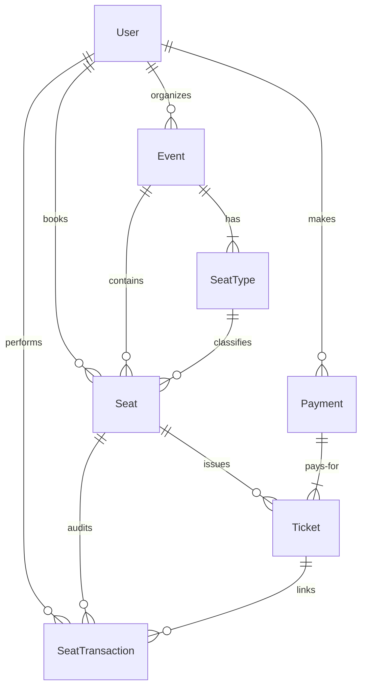

# 🎟️ EventTicket

EventTicket is a  **Online Event Ticket Booking Platform** built with **Next.js 16 (App Router)**, **React 19**, **Prisma ORM**, **Tailwind CSS**, and **PostgreSQL**. The platform features interactive seat mapping, role-based access control (RBAC).

---

## 🌟 Key Features

### 👤 Role-Based Access Control (RBAC)

- **Customers**: Browse upcoming events with rich, dynamic filtering; interact with visual seat grids to lock holds, secure tickets, and view personalized ticket history.
- **Event Organizers**: Create and manage detailed event specifications, orchestrate multi-tiered pricing, and custom seat grids (VIP, Premium, Economy) via an organizer-specific dashboard.
- **Platform Administrators**: Maintain oversight of global transactions, audits, event reviews, and general system analytics.

### 🪑 Interactive Grid-Based Seat Mapping

- **Seat Engine**: Renders real-time visual coordinate seat maps (`x_coordinate` & `y_coordinate`) configured by organizers.
- **Seat Lifecycles**: Supports critical seat states: `AVAILABLE`, `ON_HOLD` (with temporary `hold_expires_at` expirations), and `BOOKED`.
- **Seat Types**: Seamlessly enables tiered event spacing and corresponding prices.

### 🔒 Security

- Password protection encrypted via high-grade `bcrypt`/`argon2` hashing.
- **JWT Middleware**: Features edge-compatible JSON Web Token verification (`jose`) and cookie-based authorization handling via a secure routing proxy layer.

---

## 🛠️ Technology Stack

| Layer | Technology | Purpose |
| :--- | :--- | :--- |
| **Framework** | [Next.js 16](https://nextjs.org/) (App Router) | Server-side rendering (SSR), API routes, React Server Components (RSC) |
| **Frontend Library** | [React 19](https://react.dev/) | Modern state management, hooks, and component framework |
| **Styling** | [Tailwind CSS v4](https://tailwindcss.com/) & [Framer Motion](https://www.framer.com/motion/) | Slick, modern aesthetics and micro-animations |
| **Database ORM** | [Prisma ORM](https://www.prisma.io/) | Schema management, type safety, and query construction |
| **Database** | [PostgreSQL](https://www.postgresql.org/) | High-reliability, relational transactional database |
| **Authentication** | [Jose](https://github.com/panva/jose) & [Bcrypt](https://github.com/kelektiv/node.bcrypt.js) | Edge-ready JWT verification and secure password hashing |

---

## 📊 Database Architecture

The data architecture is robustly designed to enforce strict transactional integrity across concurrent seat booking operations.



### Core Entities

- **`User`**: Account repository representing platform access permissions (`Role: USER | ORGANIZER | ADMIN`).
- **`Event`**: Detailed event metadata (`status: DRAFT | PENDING | VERIFY | PUBLISHED | CANCELLED`), location, dates, and seating layouts.
- **`SeatType`**: Categories of event pricing tiers (e.g. VIP Front Row, Standard).
- **`Seat`**: The individual row/column coordinate point (`status: AVAILABLE | BOOKED | ON_HOLD`).
- **`Payment`**: Transaction details tracking payment gateways (`method: CREDIT_CARD | CASH | BANK_TRANSFER | E_WALLET | QR_CODE | PAYPAL`).
- **`Ticket`**: Individual unique entry codes associated with specific seating assignments.
- **`SeatTransaction`**: Auditable event logs detailing ticket actions (`action: BOOK | HOLD | RELEASE`).

---

## 🚀 Getting Started

Follow these steps to spin up the local development environment:

### Prerequisites

Make sure you have [Node.js](https://nodejs.org/) (v20+ recommended) and a running instance of **PostgreSQL** (or Docker).

### 1. Clone & Install Dependencies

```bash
git clone https://github.com/FengJ-196/EventTicket.git
cd EventTicket
npm install
```

### 2. Configure Environment Variables

Create a `.env` file in the root directory and configure the database URL along with JWT credentials:

```env
DATABASE_URL="postgresql://<username>:<password>@localhost:5432/<dbname>?schema=public"
JWT_SECRET="your-super-secure-jwt-secret-key"
JWT_REFRESH_SECRET="your-super-secure-jwt-refresh-secret-key"
```

### 3. Initialize the Database

Execute the Prisma migrations to create the required PostgreSQL tables, then seed initial database mock records:

```bash
# Push database schemas
npx prisma db push

# Generate Prisma Client
npx prisma generate

# Seed initial admin, organizer, users, and dummy events
npm run seed
```

### 4. Run the Development Server

```bash
npm run dev
```

Open [http://localhost:3000](http://localhost:3000) with your browser to experience the platform!

---

## 🧪 Available Scripts

Inside the project directory, you can run:

- `npm run dev`: Launches Next.js dev server on port 3000.
- `npm run build`: Bundles the optimized production build.
- `npm run start`: Runs the built Next.js server in production.
- `npm run lint`: Performs lint analysis on your code via ESLint.
- `npm run seed`: Clears existing records and runs the seeding script defined in `src/seed.js`.
